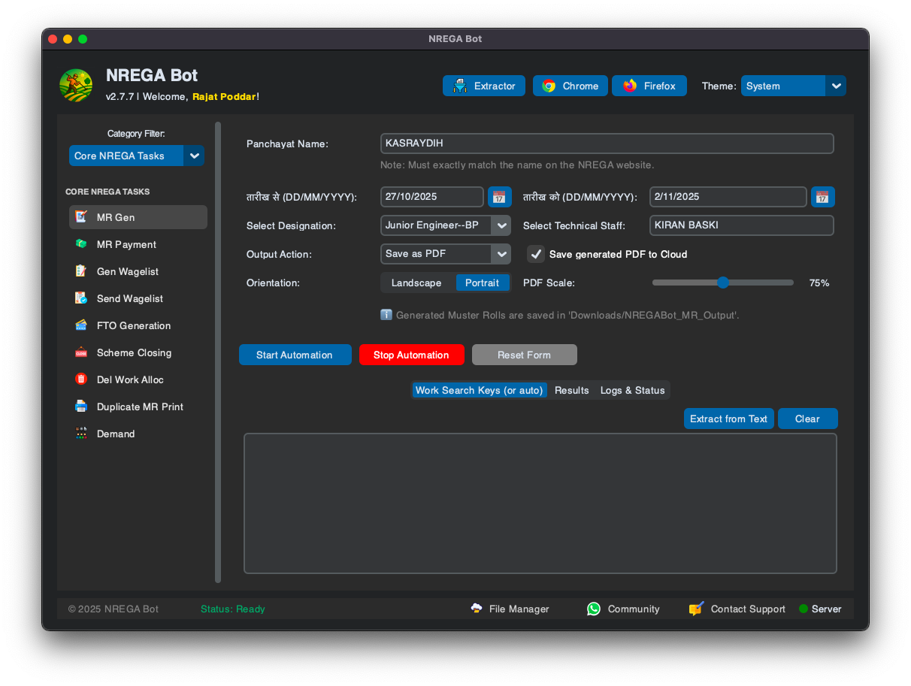
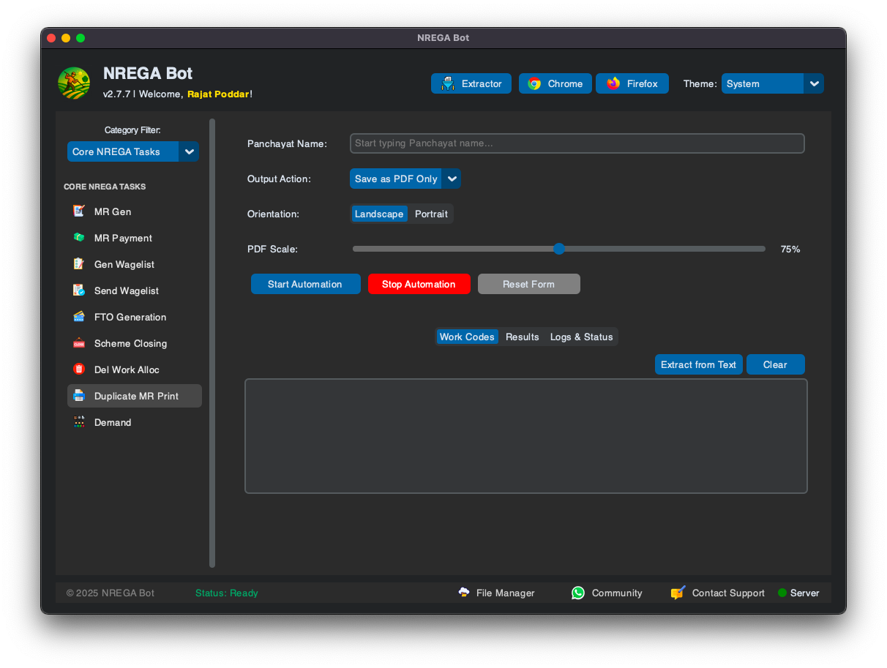
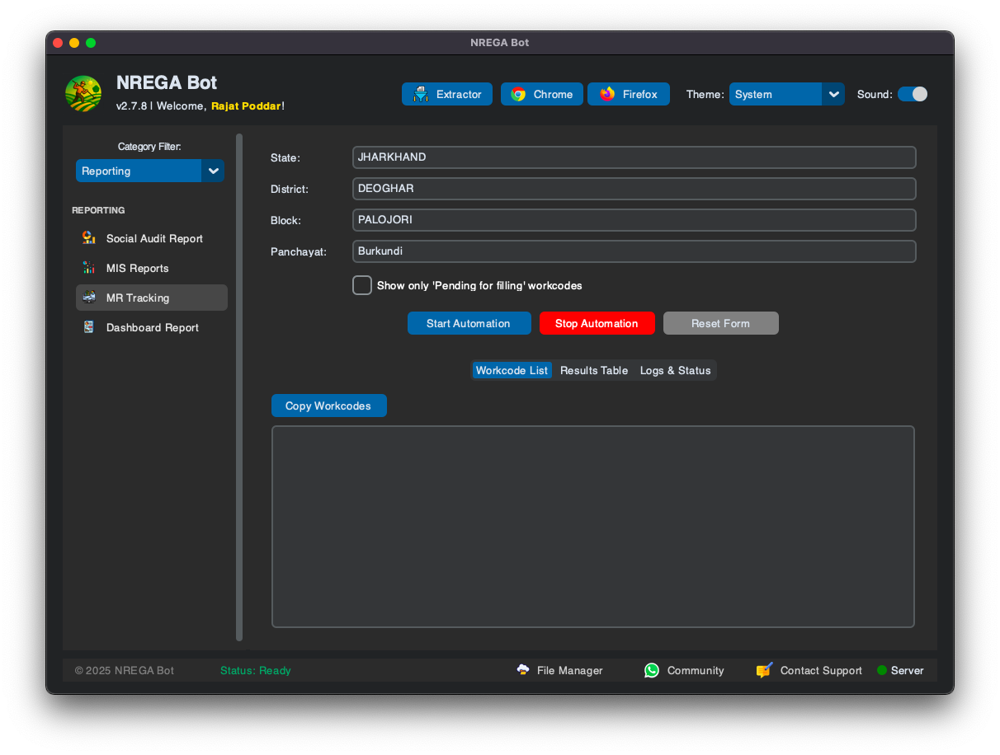
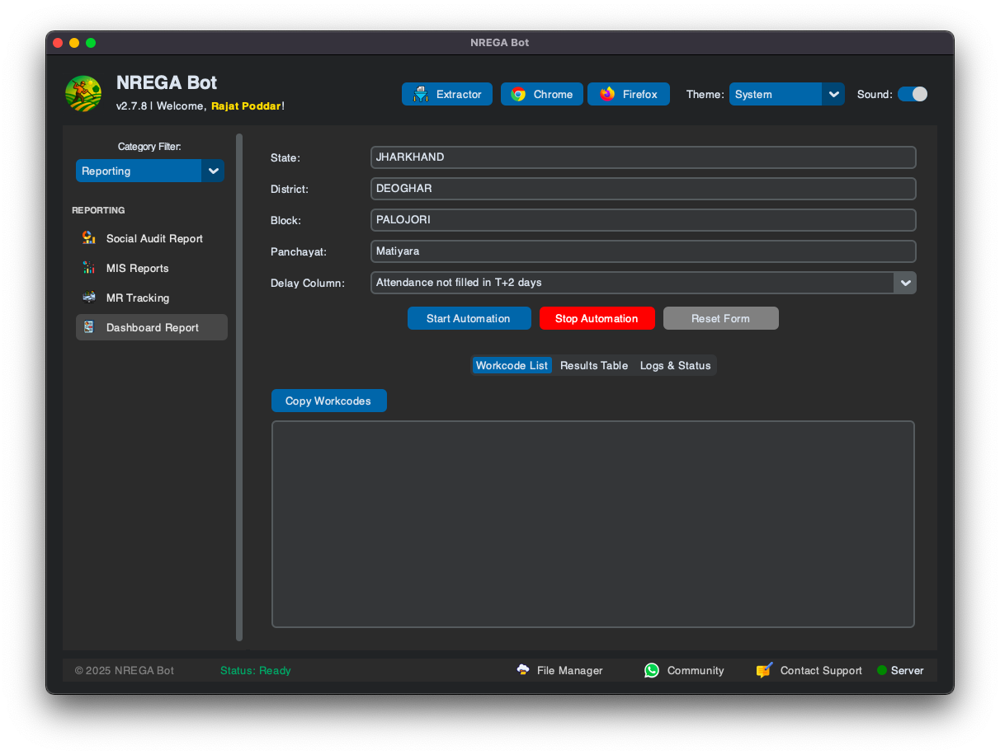
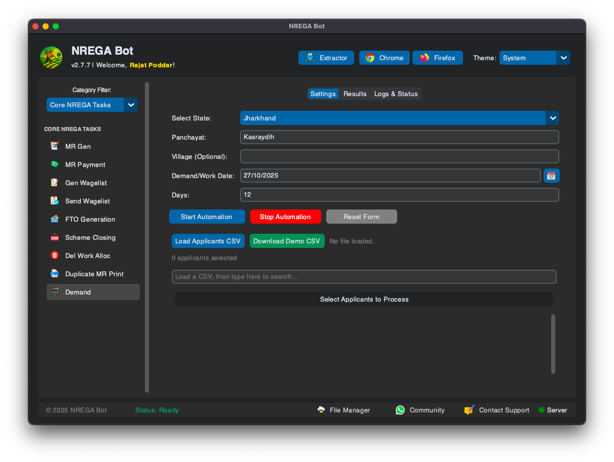
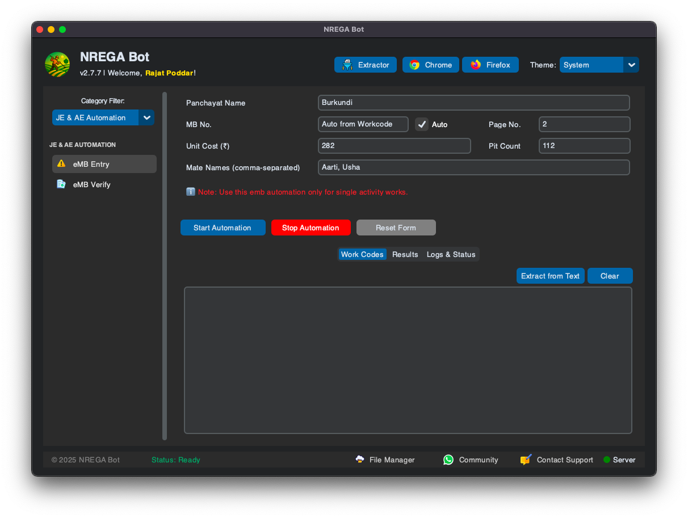

# 🚜 NREGA Bot

**v3.2.0** — Powerful NREGA Automation for Windows, macOS & Linux

[⬇️ **Download Now**](https://nregabot.com/#downloads) &nbsp;·&nbsp; [📘 How to Use](https://nregabot.com/how-to-use.html) &nbsp;·&nbsp; [🐞 Report Bug](https://nregabot.com/contact.html) &nbsp;·&nbsp; [💡 Request Feature](https://nregabot.com/#faq)

---

## 📑 Table of Contents

- [🎯 Overview](#-overview)
- [✨ Why NREGA Bot?](#-why-nrega-bot)
- [🚀 Key Features](#-key-features)
- [📸 Screenshots](#-screenshots)
- [🚀 Getting Started](#-getting-started)
- [⚙️ How It Works](#-how-it-works)
- [❓ FAQ](#-faq)
- [📜 Changelog](#-changelog)
- [🔐 License & Pricing](#-license--pricing)
- [💬 Support & Community](#-support--community)
- [⚠️ Disclaimer](#-disclaimer)

---

## 🎯 Overview

**NREGA Bot** is a powerful desktop application that **eliminates the manual, repetitive work** of the NREGA/MGNREGA portal. It securely drives a browser on your computer to automate data entry, processing and verification tasks — so you can focus on what matters.

> 🧠 *Built for Gram Rozgar Sevaks, Panchayat Secretaries, BDO offices and block-level operators who work with the VB-G-RAM-G / MGNREGA portal every day.*

---

## ✨ Why NREGA Bot?

| | Benefit |
|---|---|
| ⏱️ **Huge Time Savings** | What takes hours of manual entry finishes in minutes — automate 40+ repetitive tasks |
| 🎯 **Zero Typing Errors** | The bot reads and fills the portal precisely — no more fat-finger mistakes in job cards, MRs or wagelists |
| 🖥️ **True Background Mode** | Automations keep running while you work in other tabs — the browser stays minimized |
| 🔄 **Retry Failed in 1 Click** | Re-process only the failed entries instantly, no need to restart everything |
| ⚡ **Smart Instant Updates** | SHA-256 verified KB-size core updates — fixes ship in seconds, no re-install |
| ☁️ **Cloud Sync & Backup** | Your data & settings follow you — switch PCs or restore after a factory reset |
| 📊 **Office-Ready Reports** | Professional, print-ready Excel/PDF reports — A4 landscape, serial numbers, page numbers |
| 💬 **WhatsApp Reports** | Results & summary reports delivered straight to your WhatsApp |

---

## 🚀 Key Features

### 🏗️ MR & Wage Management

| Feature | Description |
|---|---|
| 📋 **Demand Automation** | Demand laborers from CSV with GP logins & auto 100-day limit adjustment |
| 🗑️ **Delete Demand** | Remove incorrect demands for single/multiple villages — auto-recovers from portal bugs |
| ✨ **Work Allocation** | Allocate work & remove allocations across multiple dates |
| 📂 **Muster Roll Generator** | Auto-generate & download MR PDFs with a handy **Merge PDFs** button |
| 👥 **Mate/Mistri MR** | Generate skilled/semi-skilled muster rolls for Mate & Mistri workers |
| ✨ **MR Fill** | Auto-fill muster rolls with smart holiday handling |
| ⚙️ **MSR (MR Payment)** | Process & save muster rolls from the MSR Payment page |
| 📤 **FTO Generation** | FTO verification with **Check Pending ABPS Labour** workflow |
| 📋 **Generate / Send Wagelist** | Generate new wagelists & send them for e-FMS payment |
| 🖨️ **Duplicate MR Print** | Find, save & print all muster rolls + **Merge PDFs** button |
| 🧱 **Material Entry** | Dynamic material rows (up to 15), saved material profiles, live GST totals |
| 🏁 **Scheme Closing** | Close schemes for completed works automatically |
| ✅ **Physical Complete** | Mark physical completion & auto-forward to Scheme Closing |

### 👷 JE & AE Automation

| Feature | Description |
|---|---|
| ✏️ **eMB Entry** | Auto-fill MB entry pages — professional Excel/PDF export & retry logic |
| 🔍 **eMB Verify** | Bulk-verify Measurement Book entries in seconds |

### 📝 Records & Workcode

| Feature | Description |
|---|---|
| 🏗️ **Workcode Generator** | Create work codes in bulk by loading categories & reading CSV |
| 🔧 **IF Editor** | Multi-page IF editing with a flexible UI & simple CSV inputs |
| 🪄 **Add Activity** | Automate adding activities to work codes |
| ✨ **Update Estimated Outcome** | Update 'Estimated Outcome' for a list of work codes |

### 🛠️ Utilities & Verification

| Feature | Description |
|---|---|
| ⛺ **Sarkar Aapke Dwar** | Bulk camp entry — applicant/scheme remarks automation |
| 📊 **SAD Update Status** | Update Sarkar Aapke Dwar application statuses |
| ✨ **Zero MR** | Submit Zero MR — integrated directly with MR Tracking data |
| ✅ **Jobcard Verification** | Verify job cards for a village & auto-upload the correct family photo |
| 💳 **Verify ABPS** | Check worker Aadhaar numbers with NPCI |
| ✨ **Resend Rejected Wagelist** | Reprocess wagelist payments rejected by the bank |
| 🗑️ **Delete Applicant** | Bulk-delete jobcard applicants via eKYC Report Excel or CSV |
| ✂️ **Workcode Extractor** | Parse & extract clean lists of work codes |
| 📎 **PDF Merger** | Standalone utility to merge multiple PDFs |

### 📊 Reporting

| Feature | Description |
|---|---|
| 💸 **Pending Bills** | Scrape unpaid MRs & Bills into a color-coded professional Excel |
| 📅 **NMMS Daily Attendance** | Scrape attendance, group photos & worker details into professional Excel |
| ✨ **MR Tracking** | Real-time MR status (headless) — **Pendency Report T0–T8** & Zero MR forwarding |
| ✨ **Dashboard Report** | Dashboard reports with full export capabilities |
| ✨ **Issued MR Details** | All e-muster issued works + **ABPS Pending Demand** block scan |
| 📊 **MIS Reports** | CAPTCHA solving + multi-sheet MIS Excel downloads |
| 📈 **Social Audit Reports** | Fetch Social Audit issue details automatically |
| 🆔 **eKYC Report** | Professional eKYC pending reports |

### 🧠 Smart Tools & General

| Feature | Description |
|---|---|
| 🚀 **Macro Manager** | The automation hub — queue multiple tasks to run sequentially, **Bulk Demand via CSV** |
| ✨ **Login Automation** | One-click auto-login to the NREGA portal |
| 💬 **WhatsApp Chat** | Send files & messages — plus automatic completion notifications |
| 📁 **File Manager** | Cloud file manager with **shareable folder links** |
| 🎨 **Dynamic UI** | Modern interface — Dark/Light theme, skeleton loading & sound effects |
| ☁️ **Cloud Sync & Backup** | Backup/restore data & settings, or move to a new PC in one click |
| ⚡ **Smart Updates** | SHA-256 verified core updates — small fixes ship instantly (KB size) |
| 🔁 **Retry Failed Button** | Re-process only failed entries in any automation with one click |

---

## 📸 Screenshots

 
<em>Muster Roll Generator — modern, intuitive dashboard</em>

  

 
<em>Duplicate MR Print — find, print & merge muster rolls</em>

  

 
<em>MR Tracking — pendency T0–T8 reports & Zero MR forwarding</em>

  

 
<em>Dashboard Report — comprehensive views with full export</em>

  

 
<em>Demand Automation — bulk labour demand from CSV</em>

  

 
<em>eMB Entry — professional export & retry logic</em>

---

## 🚀 Getting Started

### Prerequisites

Only a supported web browser is needed:

- 🌐 **Google Chrome** (recommended)
- 🔵 **Microsoft Edge**
- 🦊 **Mozilla Firefox**

### Installation

1. **Download** the installer for your platform:
   - **Windows**: `NREGABot-v3.2.0-Setup.exe`
   - **macOS**: `NREGABot-v3.2.0-macOS.dmg`
   - **Lite (low-end PCs)**: `NREGABot-Lite-v3.2.0-Setup.exe` or portable ZIP
2. Run the installer and launch **NREGA Bot**.

### Quick Start

1. **Register** on [nregabot.com/trial](https://nregabot.com/trial) to get your **30-day free trial** key.
2. Launch the app and activate it with your registered email or the trial key.
3. From the dashboard, click **Chrome / Edge / Firefox** — a special controlled browser window opens.
4. Log in to the **VB-G-RAM-G / MGNREGA portal** in that window, just as you normally would.
5. Open the tab for your task, fill in the details (panchayat, work codes, etc.) and hit **▶ Start Automation**.
6. Watch progress in the **Logs & Status** area — and get results in the **Results** tab when done, with one-click **Export** (Excel/PDF/CSV/WhatsApp).

---

## ⚙️ How It Works

**NREGA Bot** is a Python desktop application that securely controls a browser on your machine — it reads the portal's pages, fills forms exactly like a human would, and scrapes results into clean, print-ready reports.

| Layer | Technology |
|---|---|
| 🖥️ **Desktop GUI** | Python · CustomTkinter (modern, themeable UI) |
| 🌐 **Browser Automation** | Selenium — Chrome / Edge / Firefox |
| 📊 **Reports** | OpenPyXL (Excel) · FPDF (PDF) · Pillow (PNG images) |
| 💬 **WhatsApp** | Evolution API — automatic report delivery |
| ☁️ **Cloud** | License server, cloud sync & auto-update infrastructure |
| 🔄 **Smart Updates** | Loader + core-zip architecture — SHA-256 verified, KB-size fixes |

> 🔧 **For developers:** see [CODEBASE.md](CODEBASE.md) for the full architecture guide, entry points and build scripts.

---

## ❓ FAQ

<b>💳 Is there a free trial?</b>

Yes! Register at [nregabot.com/trial](https://nregabot.com/trial) and you get a **30-day fully-functional free trial**. Activate the app with your registered email or the trial key.

<b>🌐 Which browsers are supported?</b>

Google Chrome (recommended), Microsoft Edge and Mozilla Firefox. Pick your browser from the app's dashboard.

<b>🕐 Can I use my PC while an automation runs?</b>

Absolutely. NREGA Bot runs in **true background mode** — the browser is minimized and the automation continues running while you work in other apps or tabs.

<b>🔄 How do updates work?</b>

Updates use a **loader + core-zip** architecture. Small fixes ship as KB-size packages that are **SHA-256 verified** before applying — no re-install needed. The About tab even shows a *Download & Install* button with the changelog.

<b>📱 Do I get WhatsApp reports?</b>

Yes! When enabled in Settings, each completed automation sends a **summary + results Excel** to your WhatsApp — plus the web portal can send **date-wise combine reports**.

<b>💻 I have a low-end PC — will it work?</b>

Yes — a special **Lite build** is available for low-end PCs with a reduced feature set and no animations/sounds.

---

## 📜 Changelog

### 🆕 What's New in v3.2.0

- 📍 **Panchayat Column in Results** — every results table now shows which row belongs to which Panchayat, even in *My Saved Panchayats* mode.
- 🔢 **Serial Number (Sr. No.)** — a local serial number is now the first column of every results table and export (website serial is ignored).
- 📅 **Smart File Names** — exported reports now include date & time in the filename — no more overwrites or manual renaming.
- 🏘️ **Saved Panchayats** — process your saved panchayats directly (ABPS Verify, Muster Roll, eMB Verify, Wagelist Gen).
- 🔁 **Multi-Panchayat** — enhanced multi-panchayat processing in MR Tracking, MSR and Zero MR.
- 💬 **WhatsApp Report Toggle** — a dedicated toggle for WhatsApp report notifications.
- 🖨️ **Print-Ready Excel Reports** — A4 landscape, fit-to-width, repeating headers & page numbers — print and submit straight to the office.
- 🧩 **Windows Update Fix** — core zip version detection now works correctly.

<b>Previous versions</b>

#### v3.1.7
- 🔐 Google Login, 🪪 Passkey (WebAuthn) login, 📧 OTP Login on web
- 📦 Cloud storage full/nearly-full alert with one-click upgrade/cleanup
- ▶️ Running automations shown live in the UI footer
- 🔒 Web portal security & cloud report sync improvements

#### v3.1.6
- 🐞 ABPS Verification crash fix (village-wise) + speed boost
- 💬 WhatsApp throttle protection via global queue (2–6s pacing)
- 📊 Single WhatsApp setting — summary + Excel in one message
- 📁 Cloud File Manager — send cloud PDFs to clients via WhatsApp

#### v3.1.5
- 🔄 Smart Update Fix — correct version shown after update
- 🚀 Auto-restart after updates on macOS

#### v3.1.4
- 🖥️ Multi-tab workflow — automations run without grabbing browser focus
- 📑 Auto tab switching — Logs while running, Results when done
- 🔇 Sound toggle fix

#### v3.1.3
- 🌗 One-click theme switch & complete theme coverage
- 💬 Stacked, colour-coded toast notifications
- 📡 Online heartbeat, ⚡ reliable 20s update checks, 🔒 SHA-256 verified downloads

#### v3.1.2
- 🐞 Fixed 'humanize module missing' crash (About tab & File Manager)
- ▶️ Running automation indicator in footer

> 📄 Full changelog: [docs/changelog.json](docs/changelog.json)

---

## 🔐 License & Pricing

- **Trial**: 30-day fully-functional free trial after web registration.
- **License**: A license key is required after the trial to continue using automation features.

Affordable **Monthly, Quarterly, Half-Yearly and Yearly** plans are available.

| Plan | Ideal for |
|---|---|
| 🗓️ Monthly | Trying it out / short projects |
| 🗓️ Quarterly | Regular day-to-day automation |
| 🗓️ Half-Yearly | Serious operators — best value |
| 🗓️ Yearly | Full-time Gram Rozgar Sevaks & offices |

👉 **[Get Your License Key](https://nregabot.com/buy)**

🎉 **Referral Program:** Refer a new user with your code (from *My Account*) and get **15 extra days** when they buy their first plan!

---

## 💬 Support & Community

- 📧 **Email**: [nregabot@gmail.com](mailto:nregabot@gmail.com)
- 💬 **WhatsApp Community**: [Join our Group](https://nregabot.com/contact.html)
- 📘 **Instructions**: [How to Use](https://nregabot.com/how-to-use.html)
- 🐞 **Bug Reports**: [Contact page](https://nregabot.com/contact.html)

---

## ⚠️ Disclaimer

This tool automates interactions with a **live government website**. The author is not responsible for any changes to the NREGA portal that may cause the application to malfunction.

> This software is provided **"AS IS"** without warranty of any kind. Always double-check automated data for accuracy.

---

**© NREGA Bot** · Made with ❤️ for NREGA workers

👨‍💻 **Author:** [Rajat Poddar](https://github.com/rajatpoddar) · 🌐 [nregabot.com](https://nregabot.com)

