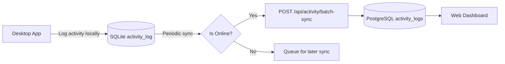

# NregaBot — Complete Application Inputs Analysis & Activity Tracking Architecture

> **Generated:** July 28, 2026  
> **Purpose:** Analyze every user input across all automation tabs, identify common patterns, and propose architecture for user activity tracking + web reporting.

---

## Table of Contents

1. [Automation Tabs Overview](#1-automation-tabs-overview)
2. [Detailed Tab-by-Tab Input Analysis](#2-detailed-tab-by-tab-input-analysis)
3. [Common Inputs Across Tabs](#3-common-inputs-across-tabs)
4. [Results / Outputs Captured Per Tab](#4-results--outputs-captured-per-tab)
5. [Current Infrastructure for Activity Tracking](#5-current-infrastructure-for-activity-tracking)
6. [Architecture Proposal: Universal Activity Tracking + Web Reporting](#6-architecture-proposal-universal-activity-tracking--web-reporting)
7. [Implementation Roadmap](#7-implementation-roadmap)
8. [Recommended New DB Schema](#8-recommended-new-db-schema)

---

## 1. Automation Tabs Overview

Total automation tabs: **33 active** (+ Login Automation hidden, + Settings, Home, About, File Management, WhatsApp Chat)

| # | Tab File | Class Name | automation_key | Category |
|---|----------|------------|----------------|----------|
| 1 | `demand_tab.py` | `DemandTab` | `demand` | Core Work |
| 2 | `wc_gen_tab.py` | `WcGenTab` | `wc_gen` | Core Work |
| 3 | `work_allocation_tab.py` | `WorkAllocationTab` | `work_allocation` | Core Work |
| 4 | `del_work_alloc_tab.py` | `DelWorkAllocTab` | `del_work_alloc` | Core Work |
| 5 | `wagelist_gen_tab.py` | `WagelistGenTab` | `wagelist_gen` | Wages |
| 6 | `wagelist_send_tab.py` | `WagelistSendTab` | `wagelist_send` | Wages |
| 7 | `resend_rejected_wg_tab.py` | `ResendRejectedWgTab` | `resend_rejected_wg` | Wages |
| 8 | `fto_generation_tab.py` | `FtoGenerationTab` | `fto_gen` | Wages |
| 9 | `mb_entry_tab.py` | `MbEntryTab` | `mb_entry` | Measurement |
| 10 | `mr_fill_tab.py` | `MrFillTab` | `mr_fill` | Measurement |
| 11 | `mr_tracking_tab.py` | `MrTrackingTab` | `mr_tracking` | Measurement |
| 12 | `duplicate_mr_tab.py` | `DuplicateMrTab` | `duplicate_mr` | Measurement |
| 13 | `mate_mr_gen_tab.py` | `MateMrGenTab` | `mate_mr_gen` | Measurement |
| 14 | `zero_mr_tab.py` | `ZeroMrTab` | `zero_mr` | Measurement |
| 15 | `issued_mr_report_tab.py` | `IssuedMrReportTab` | `issued_mr_report` | Reports |
| 16 | `mis_reports_tab.py` | `MisReportsTab` | `mis_reports` | Reports |
| 17 | `dashboard_report_tab.py` | `DashboardReportTab` | `dashboard_report` | Reports |
| 18 | `SA_report_tab.py` | `SAReportTab` | `sa_report` | Reports |
| 19 | `ekyc_report_tab.py` | `EKycReportTab` | `ekyc_report` | Verification |
| 20 | `jobcard_verify_tab.py` | `JobcardVerifyTab` | `jc_verify` | Verification |
| 21 | `abps_verify_tab.py` | `AbpsVerifyTab` | `abps_verify` | Verification |
| 22 | `emb_verify_tab.py` | `EmbVerifyTab` | `emb_verify` | Verification |
| 23 | `sarkar_aapke_dwar_tab.py` | `SarkarAapkeDwarTab` | `sad_auto` | Citizen Services |
| 24 | `sad_update_tab.py` | `SadUpdateTab` | `sad_update` | Citizen Services |
| 25 | `delete_applicant_tab.py` | `DeleteApplicantTab` | `delete_applicant` | Admin |
| 26 | `del_demand_tab.py` | `DelDemandTab` | `del_demand` | Admin |
| 27 | `scheme_closing_tab.py` | `SchemeClosingTab` | `scheme_closing` | Admin |
| 28 | `physical_complete_tab.py` | `PhysicalCompleteTab` | `physical_complete` | Admin |
| 29 | `update_estimate_tab.py` | `UpdateEstimateTab` | `update_estimate` | Admin |
| 30 | `add_activity_tab.py` | `AddActivityTab` | `add_activity` | Admin |
| 31 | `if_edit_tab.py` | `IfEditTab` | `if_edit` | Admin |
| 32 | `material_entry_tab.py` | `MaterialEntryTab` | `material_entry` | Admin |
| 33 | `msr_tab.py` | `MsrTab` | `msr` | Admin |
| 34 | `nmms_attendance_tab.py` | `NmmsAttendanceTab` | `nmms_attendance` | Monitoring |
| 35 | `musterroll_gen_tab.py` | `MusterrollGenTab` | `muster_gen` | Muster |
| 36 | `pdf_merger_tab.py` | `PDFMergerTab` | `pdf_merger` | Utility |
| — | `login_automation_tab.py` | `LoginAutomationTab` | `login_automation` | (hidden from menu) |
| — | `settings_tab.py` | — | — | Settings |
| — | `home_tab.py` | — | — | Home |
| — | `about_tab.py` | — | — | About |
| — | `file_management_tab.py` | — | — | Cloud Files |
| — | `whatsapp_chat_tab.py` | — | — | WhatsApp |

---

## 2. Detailed Tab-by-Tab Input Analysis

### 2.1 — `demand_tab.py` (Demand)
| Input Field | Widget Type | Var Name | Notes |
|-------------|-------------|----------|-------|
| **State** | `CTkOptionMenu` | `state_var` | From `config.STATE_DEMAND_CONFIG.keys()` |
| **Panchayat** | `CTkOptionMenu` | `panchayat_var` | From history_manager |
| **Demand Date (From)** | `CTkEntry` | `demand_date_entry` | DD/MM/YYYY + date picker |
| **Days** | `CTkEntry` | `days_entry` | Numeric, default 14 |
| **No. of Labour** | `CTkEntry` + Button | `custom_select_entry` | Numeric, "Select" button |
| **Work Key** | `CTkOptionMenu` | `allocation_work_key_var` | Loaded from cloud CSV |
| **CSV File (Upload)** | Button | `select_csv_button` | `filedialog.askopenfilename` |
| **CSV File (Cloud)** | Button | `cloud_csv_button` | CloudFilePicker toplevel |
| **Quick Select** | `CTkEntry` | `quick_select_entry` | JC suffixes, Enter key |
| **Search** | `CTkEntry` | `search_entry` | Live search by name/JC |
| **Select All / Clear** | Buttons | — | Batch selection |
| **Work Key Load** | Button | `load_work_key_button` | From cloud CSV |
| **Results columns** | Treeview | — | #, Job Card No, Applicant Name, Status |

### 2.2 — `wc_gen_tab.py` (Work Code Gen)
| Input Field | Widget Type | Var Name | Notes |
|-------------|-------------|----------|-------|
| **Profile** | `CTkOptionMenu` | `profile_var` | Saved profiles system |
| **Profile Name** | `CTkEntry` | `profile_name_entry` | Save/delete profiles |
| **Panchayat** | `CTkOptionMenu` | `panchayat_var` | — |
| **CSV File** | Buttons | — | Local / Cloud / Demo / Online |
| **PDF Template** | Button | `select_pdf_button` | For output |
| **Multiple form fields** | Dynamic | — | 15+ fields from WC GEN profile |

### 2.3 — `work_allocation_tab.py` (Work Allocation)
| Input Field | Widget Type | Var Name | Notes |
|-------------|-------------|----------|-------|
| **Panchayat** | `CTkOptionMenu` | `panchayat_var` | — |
| **Work Category** | `CTkOptionMenu` | `work_category_var` | ~13 category options |
| **Work List** | `CTkTextbox` | `work_list_text` | Work codes/keys list |

### 2.4 — `del_work_alloc_tab.py` (Delete Work Allocation)
| Input Field | Widget Type | Var Name | Notes |
|-------------|-------------|----------|-------|
| **Panchayat** | `CTkOptionMenu` | `panchayat_var` | — |
| **From Date(s)** | `CTkEntry` | `from_date_entry` | Multiple dates + date picker |
| **Job Cards** | `CTkTextbox` | `jobcards_text` | List of job cards |

### 2.5 — `wagelist_gen_tab.py` (Wagelist Generation)
| Input Field | Widget Type | Var Name | Notes |
|-------------|-------------|----------|-------|
| **Agency** | `CTkOptionMenu` | `agency_var` | — |
| **Save PDF** | `CTkCheckBox` | `save_pdf_var` | on/off |
| **Send to Sender** | `CTkCheckBox` | `send_to_sender_var` | on/off |

### 2.6 — `wagelist_send_tab.py` (Wagelist Send)
| Input Field | Widget Type | Var Name | Notes |
|-------------|-------------|----------|-------|
| **Financial Year** | `CTkOptionMenu` | `fin_year_var` | YYYY-YYYY format |
| **Start Wagelist** | `CTkEntry` | `start_wagelist_entry` | e.g., `34...WL068545` |
| **End Wagelist** | `CTkEntry` | `end_wagelist_entry` | Range end |

### 2.7 — `resend_rejected_wg_tab.py` (Resend Rejected Wages)
| Input Field | Widget Type | Var Name | Notes |
|-------------|-------------|----------|-------|
| **Financial Year** | `CTkOptionMenu` | `fin_year_var` | — |
| **Panchayat** | `CTkOptionMenu` | `panchayat_var` | — |
| **Process All** | `CTkCheckBox` | `process_all_var` | Toggle panchayat entry |

### 2.8 — `fto_generation_tab.py` (FTO Generation)
| Input Field | Widget Type | Var Name | Notes |
|-------------|-------------|----------|-------|
| **File/Folder Path** | `CTkEntry` | `ff_path_entry` | — |
| **Check ABPS** | Button | `check_abps_button` | — |

### 2.9 — `mb_entry_tab.py` (MB Entry)
| Input Field | Widget Type | Var Name | Notes |
|-------------|-------------|----------|-------|
| **Panchayat** | Input | — | — |
| **Mate Name** | Input | — | — |
| **Work Code** | Input | — | — |
| **Measurement data** | Multiple entries | — | Various MB fields |

### 2.10 — `mr_fill_tab.py` (MR Fill)
| Input Field | Widget Type | Var Name | Notes |
|-------------|-------------|----------|-------|
| **Wagelist** | Input | — | — |
| **Work Code** | Input | — | — |

### 2.11 — `mr_tracking_tab.py` (MR Tracking)
| Input Field | Widget Type | Var Name | Notes |
|-------------|-------------|----------|-------|
| **State** | Input | — | — |
| **District** | Input | — | — |
| **Block** | Input | — | — |
| **Panchayat** | Input | — | — |
| **Financial Year** | Input | — | — |
| **MR Status** | Input | — | — |

### 2.12 — `duplicate_mr_tab.py` (Duplicate MR)
| Input Field | Widget Type | Var Name | Notes |
|-------------|-------------|----------|-------|
| **Panchayat** | `CTkOptionMenu` | `panchayat_var` | — |
| **Output Action** | `CTkOptionMenu` | `output_action_var` | "Save as PDF Only" / "Save & Print" / "Save & Email" |
| **Orientation** | `CTkSegmentedButton` | `orientation_var` | Landscape / Portrait |
| **Work Codes** | `CTkTextbox` | `work_codes_textbox` | List of work codes |

### 2.13 — `mate_mr_gen_tab.py` (Mate MR Gen)
| Input Field | Widget Type | Var Name | Notes |
|-------------|-------------|----------|-------|
| Location fields | Multiple | — | State/District/Block/Panchayat |

### 2.14 — `zero_mr_tab.py` (Zero MR)
| Input Field | Widget Type | Var Name | Notes |
|-------------|-------------|----------|-------|
| **Financial Year** | `CTkOptionMenu` | `fin_year_menu` | — |
| **Panchayat** | `CTkOptionMenu` | `panchayat_var` | — |
| **Work List** | `CTkTextbox` | `work_list_text` | List of work codes |

### 2.15 — `issued_mr_report_tab.py` (Issued MR Report)
| Input Field | Widget Type | Var Name | Notes |
|-------------|-------------|----------|-------|
| Location fields | Multiple | — | State/District/Block/Panchayat |

### 2.16 — `mis_reports_tab.py` (MIS Reports)
| Input Field | Widget Type | Var Name | Notes |
|-------------|-------------|----------|-------|
| Location fields | Multiple | — | State/District/Block/Panchayat |

### 2.17 — `dashboard_report_tab.py` (Dashboard Report)
| Input Field | Widget Type | Var Name | Notes |
|-------------|-------------|----------|-------|
| **State** | `CTkOptionMenu` | `state_var` | From suggestions |
| **District** | `CTkOptionMenu` | `district_var` | Filtered by State |
| **Block** | `CTkOptionMenu` | `block_var` | Filtered by District |
| **Panchayat** | `CTkOptionMenu` | `panchayat_var` | Filtered by Block |
| **Delay Column** | `CTkOptionMenu` | `delay_column_var` | 5 delay-type options |
| **Workcodes** | `CTkTextbox` (output) | — | Extracted from report |

### 2.18 — `SA_report_tab.py` (Social Audit Report)
| Input Field | Widget Type | Var Name | Notes |
|-------------|-------------|----------|-------|
| **Panchayat** | `CTkOptionMenu` | `panchayat_var` | — |
| **Year** | `CTkOptionMenu` | `year_var` | YYYY-YYYY format |
| **Issue Status** | `CTkOptionMenu` | `status_var` | Pending / Closed |

### 2.19 — `ekyc_report_tab.py` (eKYC Report)
| Input Field | Widget Type | Var Name | Notes |
|-------------|-------------|----------|-------|
| **Panchayat** | `CTkOptionMenu` | `panchayat_var` | — |
| **Village** | `CTkOptionMenu` | `village_var` | Filtered by Panchayat |
| **Filter** | `CTkOptionMenu` | `filter_var` | All / Verified / Not Verified |

### 2.20 — `jobcard_verify_tab.py` (Jobcard Verify)
| Input Field | Widget Type | Var Name | Notes |
|-------------|-------------|----------|-------|
| **Panchayat** | `CTkOptionMenu` | `panchayat_var` | — |
| **Village** | `CTkOptionMenu` | `village_var` | Filtered by Panchayat |
| **Process All Villages** | `CTkCheckBox` | `process_all_villages_var` | Disables village dropdown |
| **Verify Account Only** | `CTkCheckBox` | `verify_account_only_var` | — |
| **Photo Folder** | Button | `select_folder_button` | — |

### 2.21 — `abps_verify_tab.py` (ABPS Verify)
| Input Field | Widget Type | Var Name | Notes |
|-------------|-------------|----------|-------|
| **Panchayat** | `CTkOptionMenu` | `panchayat_var` | — |
| **Village** | `CTkOptionMenu` | `village_var` | Filtered by Panchayat |

### 2.22 — `emb_verify_tab.py` (eMB Verify)
| Input Field | Widget Type | Var Name | Notes |
|-------------|-------------|----------|-------|
| **Panchayat** | `CTkOptionMenu` | `panchayat_var` | — |
| **Verify Amount** | `CTkEntry` | `verify_amount_entry` | Default 300 |
| **Work Codes** | `CTkTextbox` | `work_codes_text` | — |

### 2.23 — `sarkar_aapke_dwar_tab.py` (Sarkar Aapke Dwar)
| Input Field | Widget Type | Var Name | Notes |
|-------------|-------------|----------|-------|
| **Backlog Mode** | `CTkCheckBox` | `backlog_mode_var` | Boolean |
| **File Path** | `CTkEntry` | `file_path_entry` | CSV/XLSX |
| **App Remarks** | `CTkEntry` | `app_remarks_entry` | Text |
| **Scheme Type** | `CTkOptionMenu` | `scheme_type_var` | Multiple service options |
| **Service** | `CTkOptionMenu` | `service_var` | Dynamic based on Scheme Type |
| **Scheme Remarks** | `CTkEntry` | `scheme_remarks_entry` | Text |

### 2.24 — `sad_update_tab.py` (SAD Update)
| Input Field | Widget Type | Var Name | Notes |
|-------------|-------------|----------|-------|
| **Action** | `CTkOptionMenu` | `action_var` | Dispose / etc. |
| **Manual Text** | `CTkTextbox` | `manual_text_area` | ACK numbers |
| **File Path** | `CTkEntry` | `file_entry` | XLSX/CSV |

### 2.25 — `delete_applicant_tab.py` (Delete Applicant)
| Input Field | Widget Type | Var Name | Notes |
|-------------|-------------|----------|-------|
| **Application Reason** | `CTkOptionMenu` | `reason_var` | Predefined options |
| **Registration Reason** | `CTkOptionMenu` | `reg_reason_var` | Predefined options |

### 2.26 — `del_demand_tab.py` (Delete Demand)
| Input Field | Widget Type | Var Name | Notes |
|-------------|-------------|----------|-------|
| **Panchayat** | `CTkOptionMenu` | `panchayat_var` | — |
| **Village** | `CTkOptionMenu` | `village_var` | Filtered by Panchayat |

### 2.27 — `scheme_closing_tab.py` (Scheme Closing)
| Input Field | Widget Type | Var Name | Notes |
|-------------|-------------|----------|-------|
| **Panchayat** | `CTkOptionMenu` | `panchayat_var` | — |
| **Work Category** | `CTkOptionMenu` | `work_category_var` | 13 category options |
| **Area** | `CTkEntry` | `area_entry` | Numeric |
| **Measured By** | `CTkOptionMenu` | `measured_by_var` | JE(BP) / etc. |
| **Measured Name** | `CTkOptionMenu` | `measured_name_var` | — |
| **Cert No Start** | `CTkEntry` | `cert_no_entry` | — |
| **Completion Date** | `CTkEntry` | `completion_date_entry` | DD/MM/YYYY + date picker |
| **Skip Confirmation** | `CTkCheckBox` | `skip_confirmation_var` | — |
| **Work Codes** | `CTkTextbox` | `work_codes_textbox` | — |

### 2.28 — `physical_complete_tab.py` (Physical Complete)
| Input Field | Widget Type | Var Name | Notes |
|-------------|-------------|----------|-------|
| **Panchayat** | `CTkOptionMenu` | `panchayat_var` | — |
| **Work Category** | `CTkOptionMenu` | `work_category_var` | — |
| **Auto Forward** | `CTkCheckBox` | `auto_forward_var` | — |
| **Work Codes** | `CTkTextbox` | `work_codes_textbox` | — |

### 2.29 — `update_estimate_tab.py` (Update Estimate)
| Input Field | Widget Type | Var Name | Notes |
|-------------|-------------|----------|-------|
| **Estimated Outcome** | `CTkEntry` | `estimated_outcome_entry` | — |
| **Work Keys** | `CTkTextbox` | `work_key_text` | — |

### 2.30 — `add_activity_tab.py` (Add Activity)
| Input Field | Widget Type | Var Name | Notes |
|-------------|-------------|----------|-------|
| **Unit Price** | `CTkEntry` | `unit_price_entry` | Default from config |
| **Quantity** | `CTkEntry` | `quantity_entry` | Default from config |
| **Work Keys** | `CTkTextbox` | `work_keys_text` | — |

### 2.31 — `if_edit_tab.py` (IF Edit)
| Input Field | Widget Type | Var Name | Notes |
|-------------|-------------|----------|-------|
| **Automation Mode** | `CTkOptionMenu` | `automation_mode_var` | Full Process / etc. |
| **Profile** | `CTkOptionMenu` | `profile_var` | Saved profiles |
| **Profile Name** | `CTkEntry` | `profile_name_entry` | Save/delete |
| **CSV File** | Buttons | — | Multiple source options |
| **Dynamic form fields** | Dynamic | — | Per-profile fields |

### 2.32 — `material_entry_tab.py` (Material Entry)
| Input Field | Widget Type | Var Name | Notes |
|-------------|-------------|----------|-------|
| Multiple material fields | Various | — | — |

### 2.33 — `msr_tab.py` (MSR)
| Input Field | Widget Type | Var Name | Notes |
|-------------|-------------|----------|-------|
| Various MSR fields | Various | — | — |

### 2.34 — `nmms_attendance_tab.py` (NMMS Attendance)
| Input Field | Widget Type | Var Name | Notes |
|-------------|-------------|----------|-------|
| Attendance tracking fields | Various | — | — |

### 2.35 — `musterroll_gen_tab.py` (Muster Roll Gen)
| Input Field | Widget Type | Var Name | Notes |
|-------------|-------------|----------|-------|
| Muster roll fields | Various | — | — |

### 2.36 — `pdf_merger_tab.py` (PDF Merger)
| Input Field | Widget Type | Var Name | Notes |
|-------------|-------------|----------|-------|
| PDF file selection | Buttons | — | File dialogs |

---

## 3. Common Inputs Across Tabs

### 🔴 Tier 1 — Most Common (appear in 15+ tabs)

| Input | Frequency | Tab Names |
|-------|-----------|-----------|
| **Panchayat** | ~25 tabs | Nearly all location-based automations |
| **Village** | ~6 tabs | eKYC, ABPS, Del Demand, Jobcard Verify + others |
| **Work Codes / Work Keys** | ~10 tabs | Demand, Add Activity, eMB Verify, Scheme Closing, Physical Complete, Duplicate MR, WC Gen, etc. |
| **CSV File** | ~5 tabs | Demand, WC Gen, IF Edit, SAD, etc. |
| **Financial Year** | ~5 tabs | Wagelist Send, Resend Rejected, Zero MR, MR Tracking, SA Report |
| **Date (Demand / Completion)** | ~5 tabs | Demand, Del Work Alloc, Scheme Closing + others |

### 🟡 Tier 2 — Medium Frequency (appear in 3-8 tabs)

| Input | Frequency | Tab Names |
|-------|-----------|-----------|
| **State** | ~5 tabs | Dashboard Report, Demand, MR Tracking + others |
| **District** | ~5 tabs | Dashboard Report, MR Tracking + others |
| **Block** | ~5 tabs | Dashboard Report, MR Tracking + others |
| **Work Category** | ~4 tabs | Work Allocation, Scheme Closing, Physical Complete + others |
| **Agency** | ~2 tabs | Wagelist Gen, WC Gen |

### 🟢 Tier 3 — Unique / Tab-Specific

| Input | Tab(s) |
|-------|--------|
| **Demand Date + Days + Labour Count** | Demand |
| **Quick Select / Search (JC selection)** | Demand |
| **Profile system (save/load config)** | IF Edit, WC Gen |
| **Photo Folder** | Jobcard Verify |
| **PDF Template** | WC Gen, Duplicate MR |
| **Scheme Type + Service + Remarks** | Sarkar Aapke Dwar |
| **ABPS / eKYC Filter** | eKYC Report |
| **Amount (verify)** | eMB Verify |
| **Delay Column** | Dashboard Report |
| **Issue Status** | SA Report |
| **App/Reg Reason** | Delete Applicant |
| **Orientation (Landscape/Portrait)** | Duplicate MR |
| **Auto Forward** | Physical Complete |
| **Area + Measured By + Cert No** | Scheme Closing |
| **Unit Price + Quantity** | Add Activity |
| **Estimated Outcome** | Update Estimate |
| **Muster-specific fields** | Muster Roll Gen |
| **NMMS attendance fields** | NMMS Attendance |
| **Material entry fields** | Material Entry |

---

## 4. Results / Outputs Captured Per Tab

Nearly every tab captures results in a **Treeview** widget and allows export via:

| Export Method | Used In |
|--------------|---------|
| **CSV Export** | All tabs with `export_treeview_to_csv()` |
| **PDF Export** | ABPS, Demand, WC Gen, Report tabs |
| **Excel (openpyxl)** | eKYC Report (professional formatted) |
| **Image (Pillow)** | Via `generate_report_image()` |
| **Copy Logs** | All tabs (via Copy Logs button) |

Typical Treeview columns per tab type:

| Tab Type | Columns |
|----------|---------|
| **Demand-like** | #, Job Card No, Applicant Name, Status |
| **Verification** | Job Card No, Applicant Name, Status, Timestamp |
| **Report** | Tab-specific columns + S.No |
| **Delete-like** | Timestamp, Panchayat, Village, Applicant Info, Status, Details |

---

## 5. Current Infrastructure for Activity Tracking

### 5.1 — History Manager (`src/tabs/history_manager.py`)

Already has:
- **SQLite DB** (`nrega_local_db.sqlite`) — local per-machine
- `suggestions` table — autocomplete history for fields like `location_panchayat`, `location_village`
- `usage_stats` table — `(automation_key, count)` for frequency tracking
- `tab_inputs` table — last-used form values per tab
- **`activity_log` table** — `(id, timestamp, activity_type, description)` — **already exists!**
- `log_activity()` method — can log `(activity_type, description)`
- `get_recent_activity()` — can retrieve last N records

### 5.2 — Server DB (PostgreSQL)

Has tables:
- `licenses` — user info including `user_district`, `user_block`, `user_state`
- `payments` — transaction history
- `user_files` — cloud file storage
- `whatsapp_chat` — universal chat messages

**No existing activity/audit log for desktop automation actions.**

### 5.3 — Location Hierarchy (`src/location_hierarchy.py`)
- JSON file-based hierarchy: State → District → Block → Panchayat → Village
- `LocationHierarchy` class with `get_children()`, `add_child()`, `remove_child()`
- Used for filtering dropdowns

---

## 6. Architecture Proposal: Universal Activity Tracking + Web Reporting

### ✅ Status: All Phases Complete! (July 28, 2026)

> **Phase 1 (Enhanced Local Logging) + WhatsApp Notification ✅**  
> **Phase 2 (Server Sync: PostgreSQL + REST API) ✅**  
> **Phase 3 (Web Dashboard: User + Admin Views) ✅**  
> See details below.

### 6.1 — Vision

```
Every user action in the desktop app → logged with context:
  - Who (license_key, user name)
  - What (automation_key, action description)
  - Where (panchayat, village, block, district)
  - When (timestamp)
  - Result (success/failed/skipped + details)
  - Duration (how long it took)

→ Synced to server DB
→ Displayed on a web dashboard
→ Filterable by date, panchayat, automation type, status
```

### 6.2 — Proposed Approach

#### Phase 1: Enhanced Local Logging (Desktop App)

**A. Enrich `log_activity()` in History Manager**
Extend the existing `activity_log` table with structured fields:

```python
def log_activity_extended(
    self,
    activity_type: str,        # e.g., 'demand', 'ekyc_report', 'abps_verify'
    description: str,          # e.g., "Processed 25 applicants"
    panchayat: str = "",
    village: str = "",
    block: str = "",
    district: str = "",
    state: str = "",
    work_code: str = "",
    total_items: int = 0,
    success_count: int = 0,
    failed_count: int = 0,
    duration_seconds: float = 0.0,
    result: str = ""           # 'success', 'failed', 'partial'
):
```

**B. Create a `BaseActivityLogger` mixin or decorator**
Instead of modifying every tab, create a wrapper in `BaseAutomationTab`:

```python
class ActivityContext:
    """Context manager to track automation execution."""
    def __init__(self, tab, **context):
        self.tab = tab
        self.context = context
        self.start_time = None
    
    def __enter__(self):
        self.start_time = time.time()
        return self
    
    def __exit__(self, exc_type, exc_val, exc_tb):
        duration = time.time() - self.start_time
        # Log to history_manager.activity_log
        # Calculate success/failed from treeview
        # Sync to server if online
```

Usage in each tab:
```python
def start_automation(self):
    with self.activity_context(panchayat=..., village=...):
        # existing automation logic
```

**C. Add a sync daemon** that periodically uploads new activity log entries to the server.

#### Phase 2: Server-Side (Web Dashboard)

**A. New DB Table — `activity_logs`**

```sql
CREATE TABLE activity_logs (
    id SERIAL PRIMARY KEY,
    license_key VARCHAR(255) NOT NULL REFERENCES licenses(key) ON DELETE CASCADE,
    machine_id VARCHAR(255),
    activity_type VARCHAR(100) NOT NULL,       -- e.g., 'demand', 'ekyc_report'
    description TEXT,
    panchayat VARCHAR(255),
    village VARCHAR(255),
    block VARCHAR(255),
    district VARCHAR(255),
    state VARCHAR(255),
    work_code VARCHAR(255),
    total_items INTEGER DEFAULT 0,
    success_count INTEGER DEFAULT 0,
    failed_count INTEGER DEFAULT 0,
    duration_seconds FLOAT DEFAULT 0,
    result VARCHAR(50),                        -- 'success', 'failed', 'partial'
    app_version VARCHAR(50),
    client_timestamp TIMESTAMP,                -- When action happened on desktop
    server_timestamp TIMESTAMP DEFAULT CURRENT_TIMESTAMP,
    is_synced BOOLEAN DEFAULT FALSE
);
```

**B. API Endpoints**

| Method | Endpoint | Purpose |
|--------|----------|---------|
| `POST` | `/api/activity/log` | Desktop app sends activity log entry |
| `POST` | `/api/activity/batch-sync` | Desktop app sends batch of unsynced logs |
| `GET` | `/api/activity/stats` | Aggregated stats for dashboard |
| `GET` | `/api/activity/list?page=&from=&to=&type=&panchayat=` | Filtered log list |
| `GET` | `/api/activity/user-summary` | Per-user activity summary |

**C. Web Dashboard Pages**

1. **Overview Dashboard** — Cards showing:
   - Total automations run today/this week/month
   - Success rate %
   - Most used automations
   - Recent activity feed

2. **Detailed Reports** — Filterable table:
   - Date range picker
   - Automation type filter
   - Panchayat/Village/Block/District filter
   - Status filter (success/failed/partial)
   - Sortable columns

3. **User Activity View** — Per-license-key:
   - When they logged in last
   - What they worked on
   - Success/failure trends
   - Export as CSV/PDF

4. **Location Analytics** — Per-panchayat:
   - How many automations run per panchayat
   - Success rate per location
   - Common failures per location

#### Phase 3: Offline-First Sync



- Desktop app logs everything to local SQLite `activity_log` table
- A background thread syncs unsynced entries every 5 minutes (or on app close)
- If offline, entries stay queued and sync when connection returns
- Server deduplicates by `(license_key, client_timestamp, activity_type, description)`

#### Phase 4: Web Dashboard Tech Stack

| Component | Technology | Reason |
|-----------|-----------|--------|
| **Backend** | Python Flask (existing nrega-server) | Reuses existing auth, DB pool, deployment |
| **Frontend** | Server-rendered HTML + HTMX + Alpine.js | Minimal complexity, reuse existing patterns |
| **Charts** | Chart.js | Lightweight, CDN-delivered |
| **Tables** | Server-side DataTables with pagination | Handles millions of rows |
| **Auth** | Existing license-key based auth | Users see only their own data |
| **Hosting** | Existing server (Docker) | Same stack, new route only |

---

## 7. Implementation Roadmap

### ✅ Step 1: Desktop App — Enhance Activity Logger ✅ **(COMPLETE)**
- [x] Add `log_activity_structured()` to `HistoryManager` with structured fields
- [x] Auto-extract activity context in `BaseAutomationTab` (`_extract_activity_panchayat()`, `_extract_activity_village()`, `_extract_activity_details()`)
- [x] Migrate existing `activity_log` table schema — new columns via `_migrate_activity_log_columns()`
- [x] `log_automation_start()` / `log_automation_finish()` methods for lifecycle tracking
- [ ] Add sync queue table: `sync_queue(activity_id, is_synced, last_attempt)` — *(future)*

### ✅ Step 2: Desktop App — Add Sync Daemon → Merged with Step 5 + WhatsApp
- [x] `start_automation_thread()` now auto-logs START with panchayat/village context
- [x] `on_automation_finished()` auto-logs FINISH with duration, status, details from treeview
- [x] `_emergency_stop_all()` now logs "stopped" status for all running automations
- [x] WhatsApp notification: `_send_whatsapp_notification_if_enabled()` sends summary to user
- [x] User toggle in Settings → Default Values → "🔔 WhatsApp notification on automation finish"

### ✅ Step 3: Server — New Tables + API ✅ **(COMPLETE)**
- [x] `POST /api/whatsapp-notify-automation` — sends WhatsApp via Evolution API on automation finish
- [x] Migration `005_activity_log.sql` — `activity_logs` table with license_key, timestamp, automation_key, panchayat, status, duration_seconds, details + indexes
- [x] `ActivityLogRepository` — `sync_batch()`, `get_logs()`, `get_stats()`, `clear_logs()`, `get_all_logs()`, `count_all_logs()`
- [x] `POST /api/activity-log/sync` — Desktop app sends batch of entries (no token required, accepts license_key in body — same pattern as `automation_notify.py`)
- [x] `GET /api/activity-log` — Paginated + filtered log list for web dashboard
- [x] `GET /api/activity-log/stats` — Summary stats (total runs, today, weekly chart, most used automations, most active panchayats)
- [x] `DELETE /api/activity-log` — Clear user's logs

### ✅ Step 4: Server — Web Dashboard ✅ **(COMPLETE)**
- [x] **User Dashboard** (`/activity`) — `@session_required` protected:
  - 4 stat cards: Total Runs, Success, Failed, Avg Duration
  - Chart.js weekly bar chart + doughnut chart for most-used automations
  - Most active panchayat cards
  - Filterable activity log table with Load More
  - Dark mode support, smooth animations
  - Sidebar link in `base.html`
- [x] **Admin Dashboard** (`/admin/activity-logs`) — `@admin_required` protected:
  - 6 stat cards: Total Entries, Unique Users, Today's Entries, Success, Failed, Stopped
  - Search by name/email/mobile/license key
  - Filter by status + automation type (auto-populated)
  - Paginated table with user info + log details
  - Client-side pagination controls
  - Lazy-load API pattern (matches `transactions.py`)

### Step 5: Desktop App — Wire Up All Tabs ✅ **(COMPLETE — integrated into base classes)**
- [x] `start_automation_thread` wrapper auto-logs activity context (panchayat, village, start time)
- [x] Extract panchayat/village from tab UI vars automatically via `_extract_activity_*()` methods
- [x] Calculate success/failed from treeview at end of automation via `_extract_activity_details()`
- [x] Error cases logged via `_emergency_stop_all()` + `wrapper()` finally block

---

## 8. Recommended New DB Schema

### 8.1 — Local SQLite (Enhanced `activity_log`) ✅ **(IMPLEMENTED)**

```sql
CREATE TABLE IF NOT EXISTS activity_log (
    id INTEGER PRIMARY KEY AUTOINCREMENT,
    timestamp TEXT,
    activity_type TEXT,
    description TEXT,
    automation_key TEXT DEFAULT '',       -- e.g., 'demand', 'ekyc_report'
    panchayat TEXT DEFAULT '',            -- UPPERCASE
    village TEXT DEFAULT '',              -- UPPERCASE
    status TEXT DEFAULT '',               -- 'running', 'success', 'failed', 'stopped'
    duration_seconds REAL DEFAULT 0,      -- automation run time
    details TEXT DEFAULT ''               -- result summary like "Total: 15 | Success: 12 | Failed: 3"
);
```

> **Note:** The actual implementation has a slightly simplified schema (fewer columns than originally proposed) — `block`, `district`, `state`, `work_code`, `total_items`, `success_count`, `failed_count`, `app_version`, `is_synced` are not stored directly but can be extracted from the `details` field or added in Phase 2.

### 8.2 — Server PostgreSQL (`activity_logs` table) ✅ **(IMPLEMENTED)**

```sql
-- Migration: 005_activity_log.sql
CREATE TABLE IF NOT EXISTS activity_logs (
    id              SERIAL PRIMARY KEY,
    license_key     VARCHAR(255) NOT NULL REFERENCES licenses(key) ON DELETE CASCADE,
    local_id        INTEGER NOT NULL DEFAULT 0,       -- Original ID from desktop SQLite
    timestamp       TIMESTAMP NOT NULL DEFAULT CURRENT_TIMESTAMP,
    activity_type   VARCHAR(50) NOT NULL DEFAULT '',
    description     TEXT NOT NULL DEFAULT '',
    automation_key  VARCHAR(255) NOT NULL DEFAULT '',  -- e.g., 'demand', 'ekyc_report'
    panchayat       VARCHAR(255) NOT NULL DEFAULT '',
    village         VARCHAR(255) NOT NULL DEFAULT '',
    status          VARCHAR(50) NOT NULL DEFAULT '',    -- 'running', 'success', 'failed', 'stopped'
    duration_seconds REAL NOT NULL DEFAULT 0,
    details         TEXT NOT NULL DEFAULT '',           -- result summary
    created_at      TIMESTAMP NOT NULL DEFAULT CURRENT_TIMESTAMP
);

-- Indexes
CREATE INDEX idx_al_license_key ON activity_logs (license_key);
CREATE INDEX idx_al_created_at ON activity_logs (created_at DESC);
CREATE INDEX idx_al_automation_key ON activity_logs (automation_key);
CREATE INDEX idx_al_status ON activity_logs (status);
CREATE INDEX idx_al_license_created ON activity_logs (license_key, created_at DESC);
CREATE INDEX idx_al_panchayat ON activity_logs (panchayat);
```

### 8.3 — Files Created/Modified Across All Phases

| Phase | File | Purpose |
|-------|------|---------|
| **1** | `src/tabs/history_manager.py` | Enhanced `activity_log` table + structured logging methods + server sync methods |
| **1** | `src/tabs/base_tab.py` | Activity context extraction from widget patterns |
| **1** | `src/app/app_automation.py` | Auto-logging of START/FINISH, WhatsApp notification, server sync trigger |
| **1** | `src/tabs/settings_tab.py` | WhatsApp toggle + Activity Log viewer tab |
| **1** | `src/tabs/activity_log_tab.py` 🆕 | Desktop Activity Log viewer with Treeview + filters |
| **1** | `nrega-server/app/routes/api/automation_notify.py` 🆕 | WhatsApp notification API endpoint |
| **2** | `nrega-server/migrations/005_activity_log.sql` 🆕 | PostgreSQL migration for activity_logs table |
| **2** | `nrega-server/app/repositories/activity_log_repo.py` 🆕 | ActivityLogRepository with full CRUD + stats |
| **2** | `nrega-server/app/routes/api/activity_log.py` 🆕 | 4 REST endpoints: sync, list, stats, clear |
| **3** | `nrega-server/app/templates/public/activity_dashboard.html` 🆕 | User dashboard with Chart.js + filtered table |
| **3** | `nrega-server/app/templates/admin/admin_activity_logs.html` 🆕 | Admin panel with search, filters, pagination |
| **3** | `nrega-server/app/routes/admin/activity.py` 🆕 | Admin route + API for activity logs |
| **3** | `nrega-server/app/templates/public/base.html` | Sidebar link for Activity Dashboard |
| **3** | `nrega-server/app/templates/admin/admin_base.html` | Sidebar link for User Activity Logs |
| **3** | `nrega-server/app/routes/frontend/pages.py` | User `/activity` route added |

### 8.4 — Data Flow Architecture

```
User opens desktop app → runs automation
       │
       ▼
[BaseAutomationTab] ← auto-extracts panchayat/village from widgets
       │
       ▼
[app_automation.py::start_automation_thread()]
  - Records start_time
  - Calls history_manager.log_automation_start() → SQLite (synced=0)
       │
       ▼
Automation runs... completes or stops
       │
       ▼
[app_automation.py::on_automation_finished()]
  - Calculates duration
  - Extracts results from treeview
  - Calls history_manager.log_automation_finish() → SQLite (synced=0)
  - Calls history_manager.sync_activity_log_to_server() → background thread
       │
       ├──▶ WhatsApp notification (if enabled)
       │
       ▼
[history_manager.py::sync_activity_log_to_server()]
  - Gets unsynced entries from SQLite (synced=0)
  - POST /api/activity-log/sync {license_key, entries}
       │
       ▼
[Server::POST /api/activity-log/sync]
  - Inserts into PostgreSQL activity_logs table
  - Returns synced_count
       │
       ▼
[history_manager.py] marks entries as synced=1
       │
       ▼
[User Web Dashboard] ← fetches from GET /api/activity-log + /stats
[Admin Panel]         ← fetches from /admin/api/activity-logs
```

---

## Appendix: Key Code References

| File | Purpose |
|------|---------|
| `src/tabs/base_tab.py` | Base class — `start_automation()`, `_create_log_and_status_area()`, `update_status()` |
| `src/tabs/history_manager.py` | `log_activity()`, `save_entry()`, `get_suggestions()`, `get_filtered_suggestions()` |
| `src/location_hierarchy.py` | `get_hierarchy()`, `get_children("Panchayat", name, "Village")` |
| `src/app/app_automation.py` | `start_automation_thread()` — the central thread manager that plays sounds |
| `src/state.py` | `AppState` — `license_info`, user's state/district/block |
| `src/config.py` | `APP_VERSION`, `STATE_DEMAND_CONFIG`, `COLORS` |
| `nrega-server/app/models.py` | Server DB models — `init_db()`, `get_db()` |
| `nrega-server/routes/api/` | Flask API endpoints — existing auth and user management |
